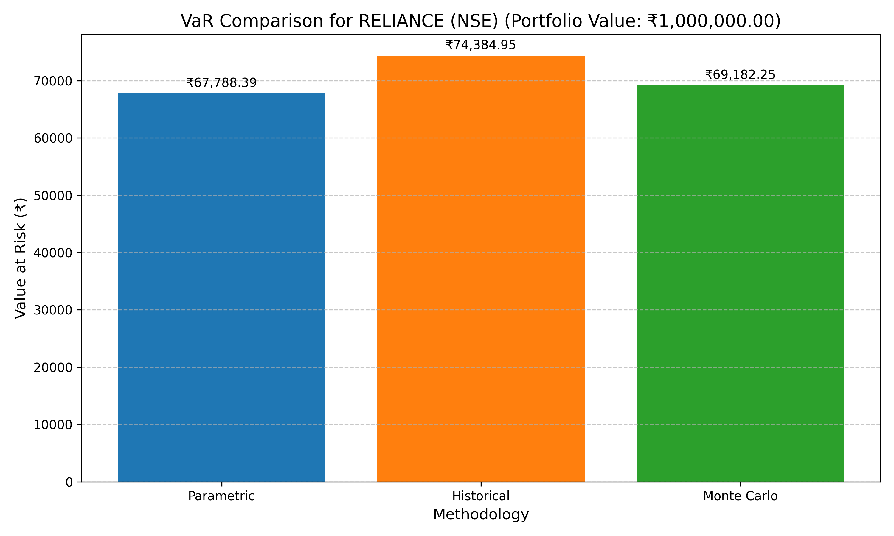

# VaR Calculator for Indian Stocks

A command-line tool that calculates Value at Risk (VaR) for Indian stocks using three different methodologies. Fetches stock data from Yahoo Finance and helps investors quantify potential portfolio losses.

## Features

- **Three Calculation Methods**:
  - 📊 Parametric (Variance-Covariance)
  - 📈 Historical Simulation
  - 🎲 Monte Carlo Simulation
- **Exchange Support**: Works with both NSE and BSE stocks
- **Visual Reports**: Generates comparative charts of results
- **Configurable Parameters**: Adjust confidence level, time horizon, etc.
- **Automatic Data Management**: Creates necessary directories at runtime
- **Comprehensive Reporting**: Saves portfolio data and generates comparison charts

## Installation

1. Clone the repository:
```bash
git clone https://github.com/iammohith/VaR_Calculator.git
cd VaR_Calculator
```

2. Install dependencies:
```bash
pip install -r requirements.txt
```

## Usage

### Basic Command:
```bash
python main.py [TICKER] [EXCHANGE] [PORTFOLIO_VALUE] [OPTIONS]
```

### Arguments:
| Argument          | Description                         | Example       |
|-------------------|-------------------------------------|---------------|
| `TICKER`          | Stock ticker symbol                 | `RELIANCE`    |
| `EXCHANGE`        | `NSE` or `BSE`                      | `NSE`         |
| `PORTFOLIO_VALUE` | Portfolio value in INR              | `1000000`     |

### Options:
| Option              | Description                          | Default |
|---------------------|--------------------------------------|---------|
| `--confidence`      | Confidence level (0.90-0.99)         | 0.95    |
| `--horizon`         | Time horizon in days                 | 1       |
| `--window`          | Historical data window (days)        | 252     |
| `--simulations`     | Monte Carlo simulations count        | 10000   |

### Example:
```bash
python main.py RELIANCE NSE 1000000 --confidence 0.99 --horizon 5
```

### Sample Output:
```
2025-07-16 10:19:28 - src.cli - INFO - Calculating VaR for RELIANCE on NSE
2025-07-16 10:19:28 - src.cli - INFO - Portfolio value: ₹1,000,000.00
2025-07-16 10:19:28 - src.cli - INFO - Confidence: 99.0%, Horizon: 5 days
2025-07-16 10:19:28 - src.cli - INFO - Data window: 252 days, Simulations: 10000

Value at Risk for RELIANCE (NSE) portfolio of value ₹1,000,000.00:
• Parametric VaR:   ₹67,788.39
• Historical VaR:   ₹74,384.95
• Monte Carlo VaR:  ₹69,182.25
```

### Sample Report:


## Project Structure

```
VaR_Calculator/
├── config/                  # Configuration files
│   ├── logging.conf         # Logging setup
│   └── settings.py          # Application settings
├── data/                    # Auto-generated data
│   ├── logs/                # Application logs
│   ├── portfolios/          # Portfolio data
│   └── reports/             # Generated charts
├── src/                     # Source code
│   ├── cli.py               # Command-line interface
│   ├── data_fetcher.py      # Stock data retrieval
│   ├── exceptions.py        # Custom errors
│   ├── historical_var.py    # Historical VaR
│   ├── monte_carlo_var.py   # Monte Carlo VaR
│   ├── parametric_var.py    # Parametric VaR
│   ├── report_generator.py  # Report creation
│   └── utils.py             # Helper functions
├── main.py                  # Application entry
├── .gitignore               # Ignore files
├── LICENSE                  # MIT License
├── README.md                # This documentation
└── requirements.txt         # Dependencies
```

## Dependencies

- Python 3.8+
- yfinance - Stock data fetching
- numpy - Mathematical operations
- pandas - Data handling
- scipy - Statistical functions
- matplotlib - Visualization

## Key Features

1. **Accurate Calculations**:
   - Industry-standard VaR formulas
   - Proper handling of time horizon scaling
   - Robust input validation
2. **Comprehensive Reporting**:
   - Portfolio data saved as CSV
   - Comparative visualization of all three methods
   - Automatic timestamping of outputs
3. **Exchange Support**:
   - Clear identification of exchange in all outputs
   - Supports both NSE and BSE
4. **User-Friendly**:
   - Detailed logging
   - Clear console output
   - Easy-to-understand reports

## Limitations

- Single-stock portfolios only
- Uses daily closing prices
- Monte Carlo assumes lognormal distribution
- Requires internet connection for data fetching

## Contributing

Contributions welcome! Please fork the repository and submit pull requests.

## License

MIT License - See [LICENSE](LICENSE) for details.
